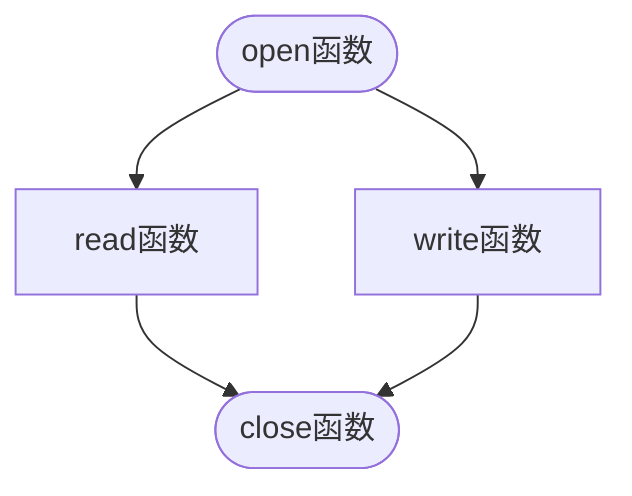

# Python编程快速上手

## 一、基本语法

### 1.1 数学运算


### 1.2 数据类型


### 1.3 常见函数

#### len()

求字符串长度，返回整数值

#### str()

将传入的参数转为字符串形式

#### int()

将传入参数转为整数形式

#### float()

将传入参数转为浮点型


### 1.4 控制流

#### 比较操作符

利用比较操作符获取布尔值（**True/False**）


#### 布尔操作符

布尔操作符：`and`、`or`、`not`（将表达式求值为一个布尔值）


#### 控制流

控制流一般形式是“**条件**”加“**代码块**”。

* **条件**

    布尔表达式，一般求取一个布尔值。【0、0.0、' '空字符串都是False】

* **代码块**

    1. 缩进增加时，代码块开始
    2. 代码块可以包含代码块（可嵌套）
    3. 缩进减少为0，该代码块结束

    


#### if、elif、else语句

加`:`即可


#### while语句


* `break`：退出while循环
* `continue`：回到循环开始处


#### for循环和range()函数

让代码执行固定次数，例如：

```python 
for i in range(5):
```

`i` 是变量，循环过程的值分别是：`0 1 2 3 4`，例如求取1加到100的和：

```python
sum = 0
for i in range(101):
    sum += i
print(sum)  #输出5050
```


* **range()详解**

该函数有三个参数，分别是起始值、终止值、步长

```python
for i in range(12,20,2):
    print(i)
# 输出：12 14 16 18
```

缺省步长：

```python
for i in range(12,16):
    print(i)
# 输出：12 13 14 15
```

负数步长：

```python
for i in range(2,-1,-1):
    print(i)
# 输出：2 1 0
```


### 1.5 导入模块

python分为内建函数与标准库。

* **内建函数**

    一组基本函数，包括：`print()`、`input()`、`len()`等

* **标准库**

    需要使用`import`关键字导入的函数模块，包括：`math`、`random`模块等

    ```python
    import random
    for i in range(5):
        print(random.randint(1,10)) # 函数调用是输出两个整数之间的任意一个随机整数
    # 输出：10 4 4 9 4
    ```
    
    导入多个标准库模块：
    
    ```python
    import random,sys,os,math
    ```
    
    省略标准库前缀的导入方式：
    
    ```python
    from random import *
    for i in range(5):
        print(randint(1,10)) # 可以省略标准库前缀
    ```


### 1.6 sys.exit()

通过调用`sys.exit()`函数可以终止或退出程序，由于该函数在`sys`模块中，所以需要提前导入

```python
from sys import *
while True:
    print("Type exit to exit the program")
    response = input()
    if response == 'exit':
        exit();
    print('You typed'+response+'.')
```


## 二、函数

### 2.1 定义函数

```python
def hello():
    print("hello!") # 函数体不在第一次定义处执行，而在被调用时执行 
```


### 2.2 调用函数


### 2.3 作用域

* **局部作用域**

    在函数内定义的变元（可以理解为形参）和变量，属于局部作用域，这些变元或变量被称为**局部变量**

* **全局作用域**

    在所有函数之外赋值的变量，属于全局作用域，该变量被称为**全局变量**

* **global语句**

    如果需要在一个函数内修改全局变量，就需要使用global语句

> 鼓励在函数中不使用全局变量，这样可以将函数看做一个==**黑盒**==，而不需要担心对程序其它部分产生影响


### 2.4 异常处理

程序员希望程序本身能检测到错误并处理他们，然后继续运行，而不是直接导致程序崩溃。这就需要考虑程序异常情况的处理。

下面以除数为0的错误为例来说明：

```python
def spam(divide_num):
    return 42 /divide_num
print(spam(0))
```

执行程序会报`ZeroDivisionError：division by zero`的错误


异常情况使用`try`和`except`关键字来处理，前者后面跟可能出现异常的语句或代码块，后者后面跟异常发生时处理的语句：

```python
def spam(divideBy):
    try:
        return 42 / divideBy
    except ZeroDivisionError:
        print("Error: Invalid argument!")
```


### 2.5 综合案例

#### 猜数字

```python
from random import*
secret = randint(1,20)
print("I am thinking a number between 1 and 20.")

for guessCircle in range(1,7): # 有6次机会
    print("take a guess")
    ans = int(input())
    if ans < secret:
        print("low")
    elif ans > secret:
        print("high")
    else:
        break

if ans == secret:
    print("Good!You guessed my number in "+str(guessCircle)+' times')
else:
    print("Nope!The secret number is"+str(secret))
```

【注意】因为要利用`+`将整数值链接为字符串，所以需要将`guessCircle`和`secret`用`str()`函数转化为字符串类型。如果打印的格式是：`print("Guess numbers is: ",guessCircles)`就可以直接打印整数而不需要转化为字符串形式。


#### Collatz序列

`collatz()`函数会将参数`num`判断奇偶，若为偶数，打印出`num // 2`并返回该值；若为奇数，	打印并返回`3 * num + 1`。

编写程序，让用户输入一个整数，并不断调用collatz函数，直至函数返回值为1。

```python
def collatz(num):
    if num % 2 == 0:
        print("num // 2")
        return num // 2
    else:
        print("3 * num + 1")
        return 3 * num + 1
    
print("Please input an integer number: ")
try:
    num = int(input())
except ValueError:
    print("Input number must be integer!")
while(True):
    if collatz(num) == 1:
        break
```


## 三、列表

列表与元组数据结构可以包含多个值，这样就使编写处理大量数据的程序变得容易。


列表可以被看做一个“列表值”：

* 保存在变量中
* 作为函数参数


**表项**

表项是一组同类型的值，用逗号隔开：

表项可以是字符串`['a','b','c']`也可以是数值`[1,2,3]`


**下标**

下标从0开始

```python
spam = [1,2,3]
for n in range(3):
    print(spam[n])
# 输出结果为：1 2 3
```

利用下标给变列表的值

```python
spam = [1,2,3]
spam[2] = 4
print(spam)
# 输出: 1 2 4
```


**负数下标**

负整数`-1`是指列表中最后一个元素，向前推则是`-2`，即从尾到头负增长


**切片**

如果说下标是从列表中取出一个值，那么切片就是从列表中取出多个值。

切片格式`[start:end]`

第一个整数是切片开始时的下标，第二个整数是切片结束下标的下一个下标。

```python
spam = ['cat','rat','bat','mat']
print(spam[0:2])
# 输出：['cat','rat']
```

* 省略第一个下标相当于左边取0
* 省略第二个下标相当于右边取列表长度，即最大下标加1


**获取列表长度**

使用函数`len()`

```python
spam = ['cat','rat','bat','mat']
print(len(spam))
# 输出：4
```


**删除列表中的表项**

使用`del`语句

```python
spam = [1,2,3]
del spam[2]
print(spam)
# 输出：1 2
```


**判断元素是否存在与列表中**

利用`in`和`not in`关键字来生成判断元素是否在列表中的布尔表达式


### 3.1 列表用于循环

```python
for i in [1,2,3,4]: # 与range(1,5)相同作用
    print(i)
# 输出：1 2 3 4
```

【技巧】迭代列表的每个下标：

```python
spam = [1,2,3,4]
for i in range(len(spam)):
    print(spam[i])
# 输出：1 2 3 4
```


### 3.2 方法

方法和函数类似，只是它是调用在一个值上。

#### index()

用`index()`方法可以在列表中索引一个值，如果在列表中返回下标，不在则报ValueError错误

```python
spam = [1,2,3,4,5]
print(spam.index(4)) #返回3
print(spam.index(7)) #返回ValueError：7 is not in list
```

如果列表中存在重复的值，返回第一次出现的位置：

```python
spam = [1,2,3,2,5]
print(spam.index(2)) #返回1
```


#### append()

利用`append()`方法可以将新元素添加至列表末尾

```python
spam = [1,2,3,4,5]
spam.append(6)
print(spam) #输出：1 2 3 4 5 6
```


#### insert()

`insert()`方法可以将新元素添加到列表的任意位置

```python
spam = [1,2,3,4,5]
spam.insert(1,7)
print(spam) #输出：1 7 2 3 4 5
```


#### remove()

`remove()`方法可以从列表中删除指定元素，若该元素不在列表中则返回ValueError错误

```python
spam = [1,2,3,4,5]
spam.remove(3)
print(spam) #输出：1 2 4 5
```


#### sort()

`sort()`可以将列表元素进行升序排序

```python
spam = [4,5,1,1,0,7,-3]
spam.sort()
print(spam) #输出：[-3, 0, 1, 1, 4, 5, 7]
```

也可以添加`reverse`关键字来指定逆序排序

```python
spam = [4,5,1,1,0,7,-3]
spam.sort(reverse=True)
print(spam) #输出：[7, 5, 4, 1, 1, 0, -3]
```

【注意】

* sort()是当场排序，不要写出spam=spam.sort()这样的语句试图记录返回值

* 待排序列表中不要既有整数又有字符串，这样会报错**TypeError**

* 对字符串列表进行排序时会按ASCII字符顺序，即大写在前，若想按字典序就需要用关键字`key=str.lower`来指定

    ```python
    spam = ['A','a','Z','b']
    spam.sort(key=str.lower)
    print(spam) # 输出：['A','a','b','Z'] ???
    ```


## 四、字符串与元组

列表并不是唯一表示序列值（即线性数据）的数据类型，类似的还有字符串和元组。

### 4.1 字符串

字符串就是单个字符的列表。也支持列表操作。

字符串与列表不同之处在于，列表是“**可变的**”数据类型，列表可以添加、删除或者改变表项。字符串是“**不可变的**”数据类型。尝试改变字符串中的一个字符会导致TypeError错误。

改变字符串的正确方式是：使用切片或连接方式构造一个**新字符串**。


### 4.2 元组

元组与列表的区别有两点：

* 使用圆括号`()`而不是`[]`
* 元组是**不可变**的

【注意】

如果元组中只有一个值，需要在其后加一个逗号，否则将认为只是在普通括号内输入了一个值，而不认为是元组数据。


### 4.3 list()与tuple()

`list()`将传递给它的值转为列表类型，下例将元组转成列表：

```python
spam = ('cat','dog','hat')
new = list(spam)
print(new)
# 输出：['cat', 'dog', 'hat']
```

`tuple()`将传递给它的值转为元组类型，下例将列表转为元组：

```python
spam = ['cat','dog','hat']
new = tuple(spam)
print(new)
# 输出：('cat','dog','hat')
```


### 4.4 引用

#### 4.4.1 什么是引用

```python
a = 42
b = a
b =100
print(a)
print(b)
# 输出：42 100
```

可以看出：利用变量a给变量b赋值后改变b的值，不会改变原变量a


```python
spam = [1,2,3,4,5]
cheese = spam
cheese[1] = 'hello'
print(spam)
# 输出：[1, 'hello', 3, 4, 5]
```

可以看出：利用列表spam给cheese赋值后，改变cheese直接改变了原来的spam列表值

根本原因：创建列表`[1,2,3,4,5]`时（line 1）,我们将这个列表的***引用赋值***给了spam变量，同理利用spam给cheese变量赋值时，也只是将列表的引用拷贝给了cheese，而不是列表本身。

当改变cheese时就是改变列表本身，所以利用打印spam（引用）时打印的是已经被（cheese）改变了的列表本身。


#### 4.4.2 传递引用

引用对理解参数传递给函数的过程非常重要。


#### 4.4.3 copy()与deepcopy()

当列表或字典以引用方式传递给函数时，有时候函数可能会改变被引用的列表或字典。如果想原列表或字典不被改变，就可以使用来自`copy`模块的`copy()`函数或`deepcopy()`函数。


* `copy.copy()`用来复制列表或字典这样的可变值，而不只是复制引用

```python
import copy
spam = ['a','b','c']
cheese = copy.copy(spam)
cheese[0] = 'A'
print(cheese)
print(spam)
#输出：['A', 'b', 'c']
#     ['a', 'b', 'c']
```

可以看到此时并没有改变原来的列表本身。


* `copy.deepcopy()`用来复制列表中包含列表的情况


## 五、字典

字典是一种灵活组织和访问数据的方式。结合列表，可以创建数据结构。

* 字典是许多“值”的集合
* 字典输入时带花括号`{}`
* 字典索引可使用不同数据类型，可以用整数作为键但不局限于整数
* 字典索引被称为“键”，与和其关联的值组成***“键值对”***
* 键值对输入顺序不重要，不像列表是有排序的
* 因为字典不能排序，所以没有切片操作
* 如果访问不存在的键，将导致KeyError错误
* 可以用`in`关键字查看键是否在字典中

```python
dog = {'size':'fat','color':'black'}  # 将一个字典赋给dog变量
# 该字典的键是'size'和'color'，对应的值分别是'fat'和'black'
```


有***三个字典方法***，返回类似列表的值，分别是：`keys()`、`values()`、`items()`，但是返回的不是真正的列表。

涉及到的***三种数据类型***：`dict_keys`、`dict_values`、`dict_items`

利用`in`或`not in`可以判断字典中是否包含键或值。

### 5.1 keys()

```python
spam = {'color':'red','age':'42'}
for k in spam.keys():
    print(k)
# 输出：color age
```


### 5.2 values()

```python
spam = {'cplor':'red','age':'42'}
for v in spam.values():
    print(v)
# 输出：red 4
```


### 5.3 items()

`items()`方法`dict_items`类型值，包含的是键和值的**元组**：


### 5.4 get()

检查字典中是否存在键，除了`in`关键字外，还可以利用`get()`函数。它包含两个参数，一个是要查询的键值，另一个是查找结果为没有的备用值。

```python
test = {'a':1,'b':2,'c':3}
print('a' in test.keys())
print(test.get('d',str(0)))
# 输出：True 0
```


### 5.5 setdefault()

有时需要将字典中的某个键设置默认值，该键不存在时使用这个默认值，此时需要用到`setdefault()`方法。该方法有两个参数，第一个为键，第二个为默认值，若键已存在，设置默认值不会对该键值有影响；若键不存在则插入该键并设其值为默认值并返回设置的默认值。

```python
test = {'a':1,'b':2,'c':3}
print(test.setdefault('a',0))    # 输出：1，不改变之前的值
print(test.setdefault('d',4))    # 输出：4
print(test)   # 输出：{'a': 1, 'b': 2, 'c': 3, 'd': 4}
```


### 5.6 pprint.pprint()

如果字典本身嵌套列表或者字典，可以利用`pprint()`方法干净简洁地打印，但是需要提前导入`pprint`模块。


## 六、字符串

### 6.1 字符串字面值

如果想打印`That's a cat`，利用常规方法python只会打印到`That`默认结束，剩下的部分是无效python代码。

字符串用***双引号***`"That's a cat"`来开始和结束。

```python
test = "That's a cat"
print(test)  # 输出：That's a cat
```


### 6.2 转义字符

转义字符前面跟着***反斜杠***`\`，后面跟添加到字符串中的字符，尽管事实上是两个字符，但是公认为一个转义字符。常用转义字符见下表：


### 6.3 原始字符串

原始字符串是在字符串双引号（或单引号）之前加上`r`，这样可以忽略所有转义字符，打印出所有斜杠。

```python
print(r"That'a cat\\")  #输出：That'a cat\\
```


### 6.4 多行字符串

多行字符串使用三重单引号`'''`来起始和结束。

多行注释使用三重双引号`"""`来起始和结束。


### 6.5 下标和切片

字符串可以和列表一样使用下标和切片：

```python
test = "hello,world!"
print(test[-1])   #输出：！
print(test[4:7])  #输出：o,w
```


### 6.6 upper()、lower()、isupper()、islower()

`upper()`和`lower()`返回一个新字符串，原字符串被转为大写或小写（原字符串不被改变）。字符串中非字母字符不被改变。

```python
test = "hello,world!"
print(test.upper())   #输出：HELLO,WORLD!
print(test)           #输出：hello,world!

test01 = "HELLO,WORLD!"  
print(test01.lower())   # hello,world!
print(test01)           # HELLO,WORLD!
```

`isupper()`和`islower()`用于返回一个布尔值，判断一个字符串（字符串非空，且全为大写或小写）是大写或小写。


### 6.4 isX方法

* `ipalpha()`
* `isalnum()`
* `isdecimal`
* `isspace()`
* `istitle()`


### 6.5 startswith()和endswith()


### 6.6 join()和split()


### 6.7 对齐文本

* `ljust()`：通过插入空格实现左对齐
* `rjust()`：通过插入空格实现右对齐
* `center()`：


### 6.8 删除空白字符

* `lstrip()`
* `rstrip()`
* `strip()`


### 6.9 pyperclip模块拷贝粘贴

`pyperclip`模块有`copy()`与`paste()`函数来向计算机剪切板发送文本或接收文本。需要注意的是，`pyperclip`模块不是python自带的，需要单独安装（命令行pip命令安装即可）：

`pip install pyperclip`


安装完成后才能使用该模块：

```python
import pyperclip
pyperclip.copy('hello')
print(pyperclip.paste())  #输出：hello
```


## 七、模式匹配与正则表达式

编写一个函数`isPhoneNumber()`在字符串中查找电话号码，例如：`415-555-4242`。该函数的核心用途是检查字符串中匹配电话号码的“模式”，返回True或者False。

```python
def isPhoneNumber(text):
    if len(text) != 12:   #检查长度
        return False
    for i in range(0,3):  #检查前三位是否为数字
        if not text[i].isdecimal():
            return False
    if text[3] != '-':    #检查第一个短横线
        return False
    for i in range(4,7):  #检查中间三位是否为数字
        if not text[i].isdecimal():
            return False
    if text[7] != '-':    #检查第二个短横线
        return False
    for i in range(8,12): #检查后四位是否为数字
        if not text[i].isdecimal():
            return False
    return True
print(isPhoneNumber('415-555-4242'))  #输出：True
```


以上匹配方法代码量大，而且能做的工作有限，故引入***正则表达式（regular expression，Regex）***。

本质上，正则表达式是**文本模式**的**描述**方法。

* `\d`：是一个正则表达式，表示一位数字字符
* `\d\d\d-\d\d\d-\d\d\d\d`：是表示电话号码模式的正则表达式
* `\d{3}-\d{3}-\d{4}`：同上，重复次数可以用大括号加次数来省略


### 7.1 创建Regex对象

* 正则表达式的函数都在模块`re`中，需要提前导入该模块`import re`

* `re.compile()`：向该函数传入一个字符串，将返回一个**Regex模式对象**（简称Regex对象）

    ```python
    import re
    phoneNumRegex = re.compile(r'\d\d\d-\d\d\d-\d\d\d\d')
    # 现在phoneNumRegex变量包含了一个Regex对象
    ```


### 7.2 匹配Regex对象

`Regex`对象的`search()`方法查找传入的字符串，寻找该模式的所有匹配，若没有找到则返回`None`。如果找到了该模式将返回一个`Match`对象。

`Match`对象中有一个`group()`方法，它将返回被查找字符串中实际匹配的文本。


## 八、文件操作

### 8.1 文件路径

* `os.getcwd()`获取当前工作路径

    ```python
    import os
    print(os.getcwd())  #输出：C:\Users\zdy\Desktop
    ```

* `os.chdir()`切换当前工作路径

    ```python
    import os
    os.chdir('C:\Users\zdy\Download')
    print(os.getcwd())  #输出：
    ```

* `os.makedirs()`创建新文件夹

* `os.path`模块

    * `os.path.join()`
    * `os.path.abspath()`
    * `os.path.isabs()`
    * `os.path.relpath()`
    * `os.path.dirname()`
    * `os.path.basename()`
    * `os.path.split()`
    * `os.path.getsize()`：返回文件字节数
    * `os.path.listdir()`：返回文件名列表
    * `os.path.exists()`：检查文件夹后文件是否存在，返回True或False
    * `os.path.isfile()`
    * `os.path.isdir()`


### 8.2 文件读写

Python读写文件的步骤如下：



1. 调用`open()`，返回一个File对象
2. 调用File对象的`read()`或`write()`
3. 调用File对象的`close()`关闭文件

提前在桌面创建一个名为hello.txt的文本文件，文件内容为：123456

```python
import os
helloFile = open('C:\\Users\\zdy\\Desktop\\hello.txt')
helloFileContent = helloFile.read()
print(helloFileContent)  #输出：123456
helloFile.close()
```

> 读取文件也可以使用`readine()`函数，一次读取一行字符串


写文件：

* `fileObject = file.open()`
* `fileObject.write('string','a'/'w')`


### 8.3 shelve模块保存变量


### 8.4 pprint.pformat()保存变量


## 十一、从web抓取信息

利用Python抓取网页信息需要用到一下几个**模块**：

* `webbrowser`：Python自带模块，打开浏览器获取指定页面
* `requests`：从因特网下载文件和网页
* `Beautiful Soup`：解析HTML，即网页编写格式
* `selenuim`：启动并控制一个Web浏览器。该模块可以填写表单，并模拟鼠标在浏览器中的点击动作。


### 11.1 webbrowser

#### 启动浏览器

```python
# 启动浏览器并打开指定页面（URL）
import webbrowser
webbrowser.open('www.baidu.com')
```


### 11.2 requests

`requests`模块用来从Web上下载文件，不是python自带的，需要自己安装（通过命令行：`pip install requests`）。

#### 下载网页

```python
import requests
res = requests.get('https://www.gutenberg.org/cache/epub/1112/pg1112.txt')
print(type(res))
print(len(res.text))
print(res.text[:250])
```

#### 保存网页信息

```python
import os
import requests
res = requests.get('https://www.gutenberg.org/cache/epub/1112/pg1112.txt')
print(res.raise_for_status())  #检查错误
playFile = open('test.txt','wb')   #由于是在桌面hello.py文件中写代码，所以会默认将test.txt创建在桌面上（也就是说：文件会保存在当前工作目录），wb参数是用二进制方法打开新文件
for chunk in res.iter_content(100000): #利用Response对象的"iter_content"方法循环10万字节
    playFile.write(chunk)
playFile.close()
```


### 11.3 查看网页信息

* ***查看网页源码***

    右键网页，点击查看网页源码即可

* ***打开浏览器开发者工具***

    右键网页，点击查看即可

* `BeautifulSoup`***解析HTML***

    `BeautifulSoup`模块的名称是`bs4`，使用命令`pip install beautifulsoup4`安装。

    * `bs4.BeautifulSoup()`

        该函数接受一个HTML字符串（即要解析的HTML）返回一个BeautifulSoup对象，例：

        ```python
        import requests
        import bs4
        res = request.get('https://nostarch.com')
        res.raise_for_status()
        soupTest = bs4.BeautifulSoup(res.text)
        print(type(soupTest))
        ```

        该函数也可以HTML文件

    ```mermaid
    flowchart TB
        A([bs4.Beautifulsoup函数]) --> B(字符串参数) & C(HTML文件参数)
    ```

    

    


## 附录：运行python脚本

使用IDLE有两个弊端：

1. 每次都要打开脚本文件
2. 无法向终端传递参数

所以需要要抛弃IDLE，使用一种方法在任何操作系统运行python脚本程序，并能向终端传递参数：
