# Mermaid in Typora

参考资料：https://mermaid-js.github.io/mermaid/#/

## 一、流程图（Flowchart）

所有的流程图都由以下几个元素构成：

* 节点（node）
* 几何图形（geometric shapes）
* 边框（edge）
* 线段和箭头（line and arrow）

mermaid语法支持几乎所有元素的自定义，以及子图（subgraph）的嵌入与关联。

> 【**注意**】节点的命名需要首字母大写或者全拼大写（“End”或“END”），否则可能造成构图失败


### 1.1 节点（Node）

节点可以理解为边框（edge）和文本（显示在边框中的内容）的组合，下图中文本是`Id`边框是实线矩形：

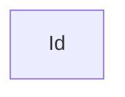

#### 1.1.1 自定义边框

自定义边框是在初始文本后面跟一些组合符号，组合符号内加上最终文本（会覆盖初始文本）。在这里初始文本都以`id1`为例，最终文本为边框形状。

* 圆角矩形（round edges）

    ```mermaid
    flowchart LR
        id1(round edge)
    ```

* 体育场形（stadium-shaped）

    ```mermaid
    flowchart LR
        id1([stadium-shaped])
    ```

* 子程序形（subroutine shape）

    ```mermaid
    flowchart LR
        id1[[subroutine shape]]
    ```

    

* 圆柱形（cylindrical）

    ```mermaid
    flowchart LR
        id1[(cylinder)]
    ```

* 圆形（circle）

    ```mermaid
    flowchart LR
        id1((circle))
    ```

* 不对称形状（asymmetric）

    ```mermaid
    flowchart LR
        id1>asymmetric]
    ```

* 菱形（rhombus）

    ```mermaid
    flowchart TB
        id1{rhombus}
    ```

* 六边形（hexagon）

    ```mermaid
    flowchart LR
        id1{{hexagon}}
    ```

* 平行四边形（parallelogram）

    ```mermaid
    flowchart TB
        id1[/parallelogram/]
    ```

* 反平行四边形（parallelogram alt）

    ```mermaid
    flowchart TB
        id1[\parallelogram alt\]
    ```

* 梯形（Trapezoid）

    ```mermaid
    flowchart TB
        id1[/Trapezoid\]
    ```

* 倒梯形（Trapezoid alt）

    ```mermaid
    flowchart TB
        id1[\Trapezoid alt/]
    ```

* 圆环形（Double circle）

    由于版本原因，暂时无法回绘制。

    

### 1.2 图方向（Graph）

确定图的方向，需要声明是自顶向下`TB`还是自底向上`BT`

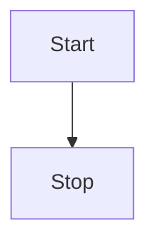

自左向右`LR`

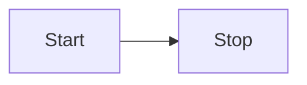

图方向汇总：

* `TD`：自上而下（同TB）
* `TB`：自顶向下
* `BT`：自底向上
* `LR`：从左往右
* `RL`：从右往左


### 1.3 连接线（Links）

节点之间可以通过线（link）或者边（edge）来连接

#### 1.3.1 实线

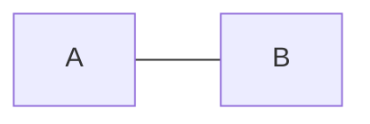

#### 1.3.2 带箭头实线

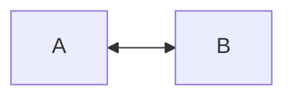

#### 1.3.3 带文本实线

* 不带箭头

    方法一：


​        方法二：

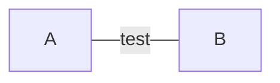

* 带箭头

    方法一：

    ```mermaid
    flowchart LR
        A -- text --> B
    ```

    方法二：

    ```mermaid
    flowchart LR
        A -->|test| B
    ```

#### 1.3.4 带箭头虚线

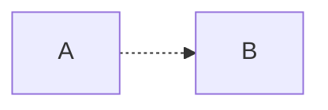

#### 1.3.5 带文本虚线

```merimaid
flowchart LR
    A-. text .->B
```

#### 1.3.6 粗实线

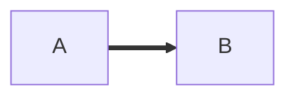

带文本：

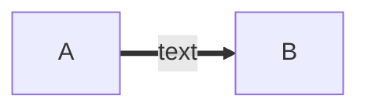

#### 1.3.7 链式连接

不带文本：

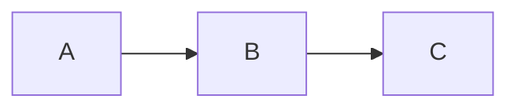

带文本：

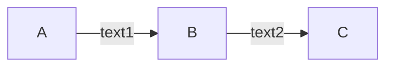

平行链路：

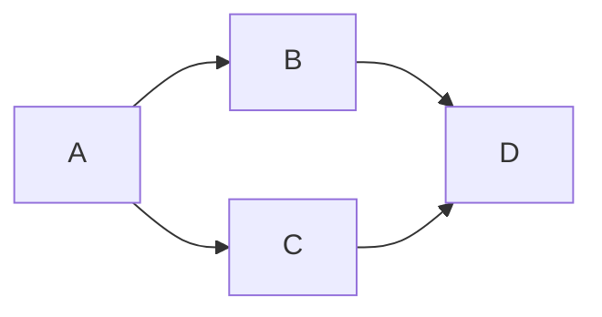

交叉链路：

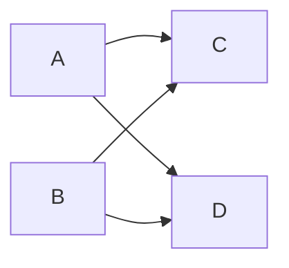


### 1.4 指定连接长度

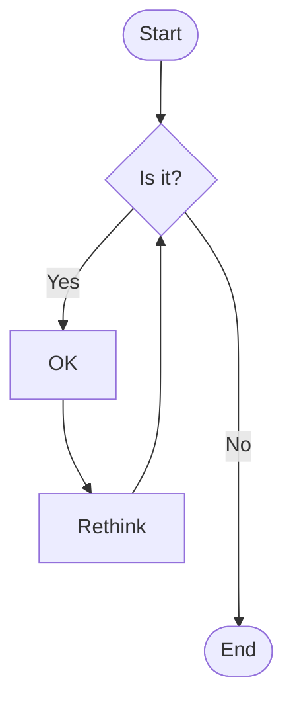

> 在`B`到`E`的连接语句中，额外指定了两个短横线`--`，这样就会跳过默认长度的两级（rank）

常用线形与级数长度对照如下：


### 1.5 子图（Subgraph）

添加子图格式如下：

```
subgraph title
    graph definition
end
```

【例子】

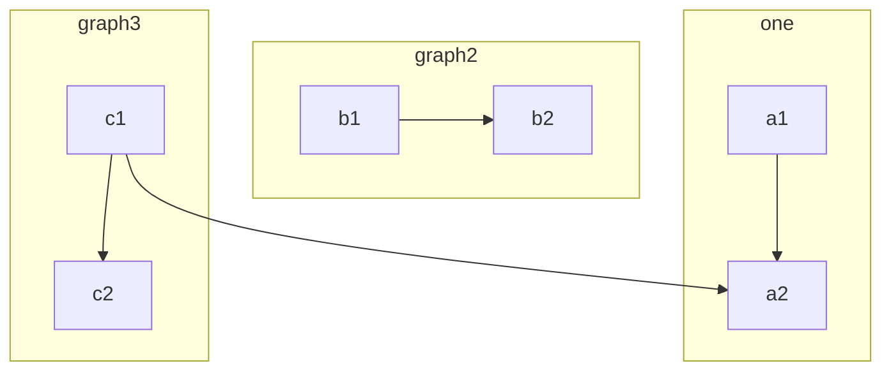

【子图和子图的边也可以连接】

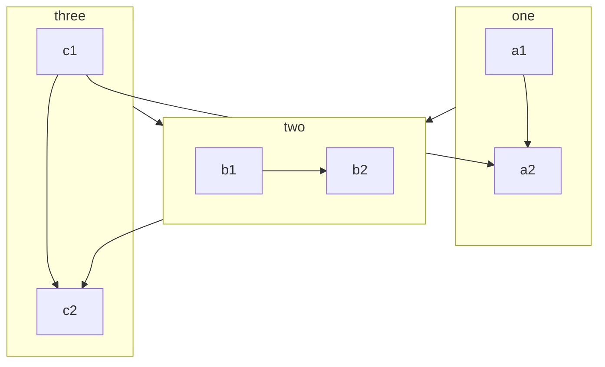

【子图方向】

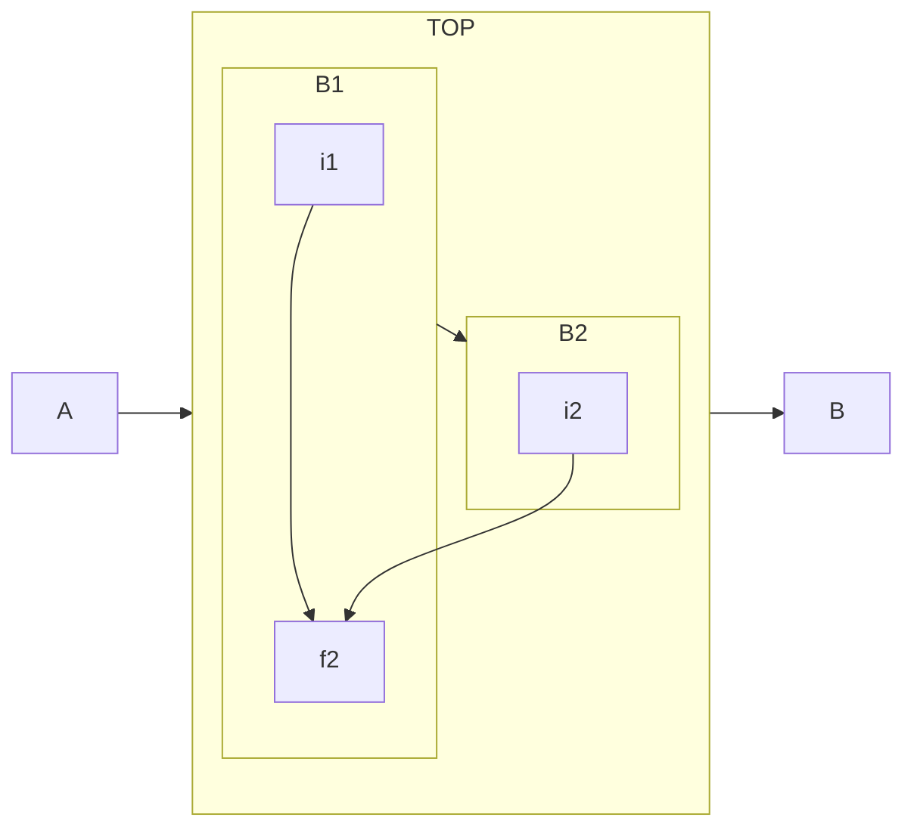


### 1.6 TCP/IP网络协议栈实战

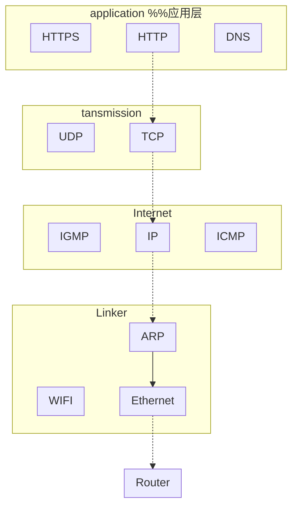


